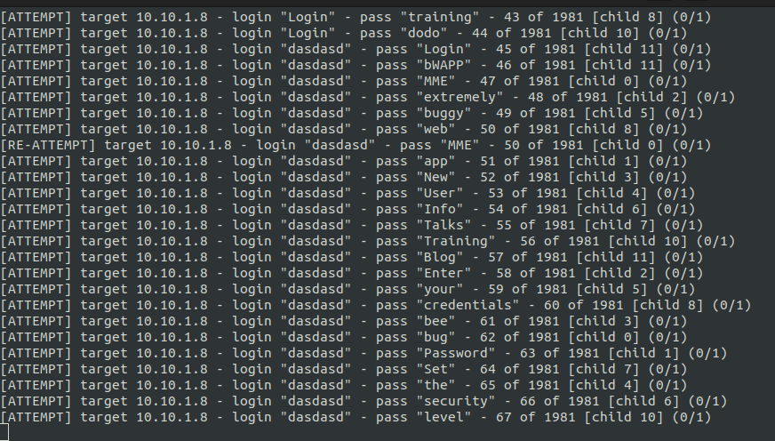
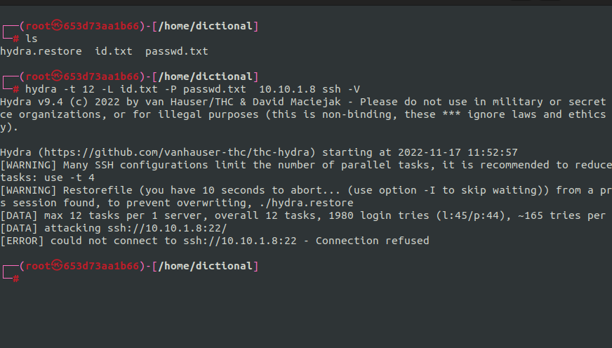

# dictional attack and defend



The attack technique, also called a dictionary attack or brute force, is the mose basic attack and the most critical attack if successful.  
Many attackers tries to Dictional Attack  
Whether it's personal curiosity or financial reasons  
In particular, there are some kids who systematically try to automate attacks all over the world  
Even if the password is annoying, you should never use an easy password and ot should not be exposed  

# ssh dictional attack

# id passwd

> id: dodo
> passwd: dodo

``` bash
cat id.txt | nl | grep dodo
```
> 44 dodo

``` bash
cat passwd.txt | nl | grep dodo
```
> 44 dodo

# Attack Enviroment

``` bash
hydra -t 12 -L id.txt -P passwd.txt  10.10.1.8 ssh -V  
```

# delete or disable

if u don't want openssh server, it is recommended to delete or disable it.

## disable

``` bash
sudo service ssh stop && \
sudo service ssh status
```

## delete

``` bash
sudo apt -y remove openssh-server
```

# defend
if u need to use openssh server, please do as below.

``` bash
sudo vim /etc/ssh/sshd_config
```

> Max Authnumber  && \
sudo service ssh status

``` bash
MaxAuthTries 2 # Max tries
MaxSessions 4 # Max Session (Max ssh connecting user)
```

``` bash
sudo service ssh reload && \
sudo service ssh status
```

``` bash
Port 9000
```

``` bash
sudo service ssh reload && \
sudo service ssh status
```

``` bash
sudo ufw enable
```

``` bash
sudo ufw allow 9000/tcp
```

> Result



